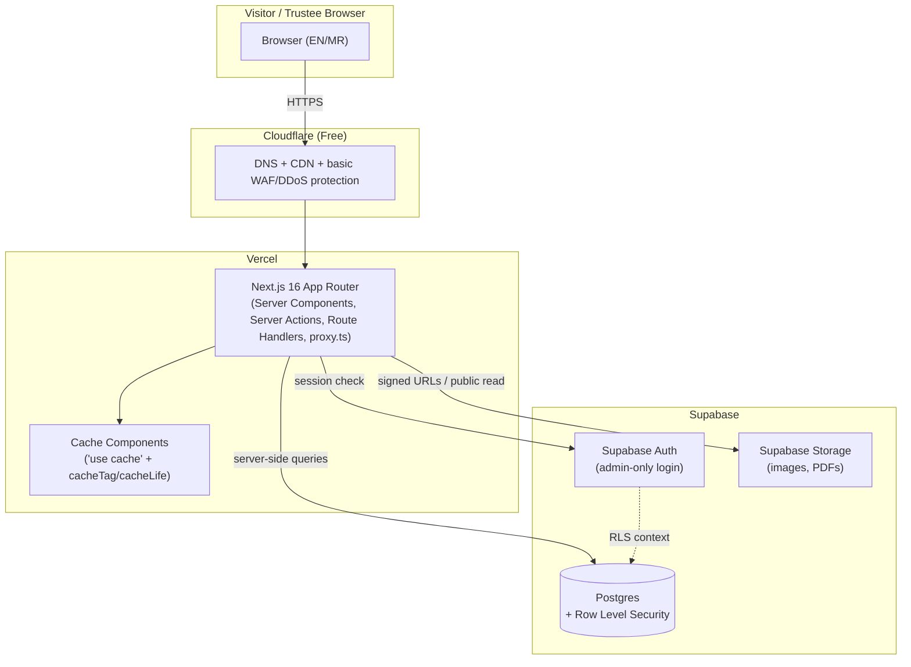

# 02. Architecture

## System diagram

## Request flow

- **Public page (e.g. Events list)**: request → Cloudflare (cached at edge where possible) → Vercel →
  Next.js renders a Server Component that reads from Postgres (published rows only, enforced by RLS) →
  response cached via Cache Components with a `cacheTag('events')`.
- **Admin publishes an event**: Server Action validates input (zod) → writes to Postgres via Supabase client
  (RLS requires an authenticated admin role) → calls `updateTag('events')` so the public Events page reflects
  the change immediately without a full redeploy.
- **File upload (image/PDF)**: Server Action validates MIME type + size → uploads to Supabase Storage in the
  matching bucket/folder (see [Storage Structure](08-storage-structure.md)) → stores the returned path in
  Postgres, not the raw file.

## Tech stack rationale

- **Next.js 16 (App Router)** — server-first rendering minimizes client JS (good Lighthouse scores), built-in
  Metadata API and file conventions (`sitemap.ts`, `robots.ts`) cover SEO requirements natively.
- **TypeScript** — catches schema/shape mismatches between DB, Server Actions, and UI at compile time; the
  main lever for 5–10 year maintainability with changing contributors.
- **Tailwind CSS v4 + shadcn/ui** — utility CSS with zero runtime cost, and shadcn/ui components are copied
  into the repo (not an npm dependency to track), so they can be customized freely and never go stale.
- **Supabase (Postgres + Auth + Storage)** — one platform for database, auth, and file storage means fewer
  moving parts and one bill, with Postgres RLS giving defense-in-depth authorization independent of app code.
- **Vercel** — first-class Next.js support (this is the same company), automatic preview deployments per PR,
  generous free tier for low traffic.
- **Cloudflare (Free)** — DNS management, CDN caching, and basic DDoS/WAF protection in front of Vercel at no
  cost; also the natural place to buy the domain later (Cloudflare Registrar sells at wholesale price).

## Rendering strategy (Next.js 16 specifics)

Next.js 16.2.12 ships docs (`node_modules/next/dist/docs/`) that differ from older/generic Next.js knowledge
in several ways relevant to this architecture — confirmed by reading those docs directly:

- **Default caching**: `fetch()` is uncached by default; a page is statically rendered automatically as long
  as it doesn't read dynamic request data (cookies, headers, search params) at request time.
- **Cache Components (stable in v16)**: enable via `cacheComponents: true` in `next.config.ts`. Wrap
  CMS-backed data reads in a `'use cache'` function with `cacheLife()` (how long to cache) and `cacheTag()`
  (a label to invalidate by). When an admin edits content, the Server Action calls `updateTag('events')` (or
  `'gallery'`, `'news'`, etc.) to invalidate just that tag — this is this project's ISR equivalent, replacing
  the old experimental `experimental.ppr`/`dynamicIO` flags which are removed in v16.
- **`proxy.ts` replaces `middleware.ts`**: the file must be named `proxy.ts` and export a function named
  `proxy` (not `middleware`); it runs on the Node.js runtime only (no Edge runtime support in v16). This
  project uses it for admin-route session gating and lightweight rate limiting on the contact form.
- **Async request APIs**: `cookies()`, `headers()`, `draftMode()`, and `params`/`searchParams` are
  Promise-only in v16 (the Next 15 "still works synchronously" compatibility shim is gone) — every Server
  Component, Route Handler, and Server Action in this project must `await` them.
- **Images**: `next/image` defaults changed (`minimumCacheTTL` 4h, `qualities: [75]`, `images.domains`
  removed in favor of `remotePatterns`) — relevant when serving images from Supabase Storage's public URLs
  (see [Storage Structure](08-storage-structure.md)).

## Page rendering plan

| Page type | Strategy |
|---|---|
| Home, About, Committee (rarely-changing content) | Static rendering, `'use cache'` with a long `cacheLife` |
| Events / Gallery / News / Notices lists & detail pages | `'use cache'` + `cacheTag(<resource>)`, invalidated via `updateTag()` on publish/edit |
| Documents (PDF listing) | Same as above, tagged `'documents'` |
| Contact form submission | Server Action, no caching — always dynamic |
| Admin dashboard (all routes) | Fully dynamic, session-gated via `proxy.ts`, never cached |
