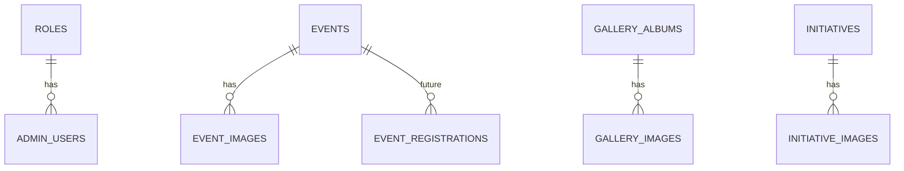

# 04. Database Schema

Postgres via Supabase. All content tables follow the same lifecycle pattern: `status` (draft/published),
`deleted_at` (soft delete), `created_at`/`updated_at`, and a `created_by`/`updated_by` reference to the
admin user — so the CMS's draft/publish and soft-delete features ([07](07-admin-cms.md)) are schema-backed,
not app-only conventions.

## Conventions

- Primary keys: `uuid default gen_random_uuid()`.
- Every content table has a unique `slug` (for SEO-friendly URLs) generated from title, editable by admin.
- Soft delete via nullable `deleted_at timestamptz`; all public queries filter `deleted_at is null and status = 'published'`.
- `status` is a Postgres enum: `'draft' | 'published' | 'archived'`.
- Timestamps: `created_at timestamptz default now()`, `updated_at timestamptz default now()` (kept current via trigger).
- Row Level Security (RLS) is enabled on every table; policies summarized per table below.

## Core tables

### `roles`
| Column | Type | Notes |
|---|---|---|
| id | uuid PK | |
| name | text unique | `'admin'` initially; extensible for `'editor'`, `'volunteer_manager'` later |

### `admin_users`
Mirrors `auth.users` (Supabase-managed) with app-specific profile data.
| Column | Type | Notes |
|---|---|---|
| id | uuid PK, FK → `auth.users.id` | |
| role_id | uuid FK → `roles.id` | |
| full_name | text | |
| created_at | timestamptz | |
RLS: readable/writable only by the row's own user or a service-role context.

### `committee_members`
| Column | Type | Notes |
|---|---|---|
| id | uuid PK | |
| full_name | text | |
| full_name_mr | text nullable | Marathi spelling of the name, for correct Devanagari rendering |
| position_key | text | stable key, not free text — see position list below |
| position_label_mr | text | Marathi title, e.g. `अध्यक्ष` — `position_key` maps to an English label in code, this column carries the Marathi one since committee titles are trust-specific, not a fixed enum |
| bio | text nullable | |
| photo_path | text nullable | Supabase Storage path, `committee/` bucket |
| display_order | int | for manual ordering |
| status, deleted_at, created_at, updated_at | — | standard lifecycle columns |
RLS: public `select` where `status='published' and deleted_at is null`; `insert/update/delete` admin-only.

`position_key` is a Postgres enum covering the trust's actual 9-member structure (confirmed with the trust):
`'adhyaksh' | 'upadhyaksh' | 'sachiv' | 'up_sachiv' | 'khajindaar' | 'up_khajindaar' | 'sadasya'` — mapped to
English (President / Vice President / Secretary / Vice Secretary / Treasurer / Vice Treasurer / Member) for
the `/en` locale and to the Marathi title for `/mr`, via a small lookup table in code
(`lib/i18n/committee-positions.ts`), not hardcoded per-row — this keeps the 3 `'sadasya'` (Member) rows
correctly labeled without needing 3 separate enum values.

### `initiatives`
The trust's ongoing causes/projects — e.g. the temple rebuild — distinct from `events` (dated, one-off
gatherings) and `news` (announcements). Modeled after how comparable trust websites present ongoing work as
its own content type (see reference sites reviewed for this plan), and designed so a future "Donate towards
this initiative" button can attach to a specific row without a schema change.
| Column | Type | Notes |
|---|---|---|
| id | uuid PK | |
| slug | text unique | e.g. `temple-rebuild` |
| title / title_mr | text | |
| summary / summary_mr | text | short teaser for card/preview use (Home, list page) |
| body / body_mr | text (rich text HTML, sanitized) | full story: background, damage, current state, need |
| initiative_status | text | `'ongoing' \| 'completed'` — distinct from the lifecycle `status` (draft/published) |
| cover_image_path | text nullable | `initiatives/<slug>/` bucket |
| display_order | int | manual ordering on the "Our Work" list page |
| status, deleted_at, created_at, updated_at, created_by | — | standard lifecycle columns |
Index: `(initiative_status, status, deleted_at)`.

### `initiative_images`
| Column | Type | Notes |
|---|---|---|
| id | uuid PK | |
| initiative_id | uuid FK → `initiatives.id` on delete cascade | |
| image_path | text | `initiatives/<slug>/` bucket path |
| caption / caption_mr | text nullable | |
| display_order | int | |
Index: `(initiative_id, display_order)`.

### `trust_settings`
A single-row table for trust-wide facts that show up across the footer, Contact page, and JSON-LD —
CMS-editable rather than hardcoded, since registration numbers/contact details can change and a trustee
should be able to update them without a code deploy.
| Column | Type | Notes |
|---|---|---|
| id | uuid PK | exactly one row, enforced by app convention (or a `check` constraint tying `id` to a fixed value) |
| trust_name / trust_name_mr | text | |
| registration_number | text nullable | Trust registration number (not yet provided — placeholder until available) |
| pan_number | text nullable | For future 80G donation receipts, if/when the trust is 80G-registered |
| founded_year | int nullable | |
| registered_address / registered_address_mr | text nullable | |
| map_latitude, map_longitude | numeric nullable | for the Contact page Google Maps embed |
| contact_email | text | POC email shown site-wide |
| contact_phone | text | POC phone shown site-wide |
| social_links | jsonb nullable | `{ "facebook": "...", "instagram": "...", "youtube": "..." }`, only populated once such accounts exist |
| updated_at | timestamptz | |
RLS: public `select` (this is all public-facing info); `update` admin-only; no `insert`/`delete` beyond the
single seed row.

### `events`
| Column | Type | Notes |
|---|---|---|
| id | uuid PK | |
| slug | text unique | |
| title | text | |
| title_mr | text nullable | Marathi translation (see i18n note below) |
| description | text (rich text HTML, sanitized) | |
| description_mr | text nullable | |
| event_date | date | |
| venue | text | |
| chief_guest | text nullable | |
| cover_image_path | text nullable | `events/` bucket |
| status, deleted_at, created_at, updated_at, created_by | — | standard lifecycle columns |
Index: `(event_date)` for chronological queries, `(status, deleted_at)` for public list filtering.

### `event_images`
| Column | Type | Notes |
|---|---|---|
| id | uuid PK | |
| event_id | uuid FK → `events.id` on delete cascade | |
| image_path | text | `events/<event-slug>/` bucket path |
| caption | text nullable | |
| display_order | int | |
Index: `(event_id, display_order)`.

### `gallery_albums`
| Column | Type | Notes |
|---|---|---|
| id | uuid PK | |
| slug | text unique | |
| title / title_mr | text | |
| description / description_mr | text nullable | |
| cover_image_path | text nullable | |
| status, deleted_at, created_at, updated_at | — | |

### `gallery_images`
| Column | Type | Notes |
|---|---|---|
| id | uuid PK | |
| album_id | uuid FK → `gallery_albums.id` on delete cascade | |
| image_path | text | `gallery/<album-slug>/` bucket path |
| caption | text nullable | |
| media_type | text | `'image'` now; `'video'` reserved for future video support |
| display_order | int | |
Index: `(album_id, display_order)`.

### `documents`
Trust deed, annual reports, audit reports, certificates, general downloads.
| Column | Type | Notes |
|---|---|---|
| id | uuid PK | |
| title / title_mr | text | |
| category | text | enum-like: `'trust_deed' \| 'annual_report' \| 'audit_report' \| 'certificate' \| 'other'` |
| file_path | text | `documents/<category>/` bucket path |
| file_size_bytes | bigint | captured at upload for display + validation audit |
| published_year | int nullable | for filtering annual/audit reports by year |
| status, deleted_at, created_at, updated_at | — | |
Index: `(category, published_year)`.

### `news` (News & Notices — one table, `type` column distinguishes them per the site's "News & Notices" page)
| Column | Type | Notes |
|---|---|---|
| id | uuid PK | |
| slug | text unique | |
| type | text | `'news' \| 'notice'` |
| title / title_mr | text | |
| body / body_mr | text (rich text HTML, sanitized) | |
| cover_image_path | text nullable | `news/` bucket |
| status, deleted_at, created_at, updated_at, created_by | — | |
Index: `(type, status, deleted_at, created_at desc)`.

### `contact_messages`
| Column | Type | Notes |
|---|---|---|
| id | uuid PK | |
| name | text | |
| email | text | |
| phone | text nullable | |
| message | text | |
| created_at | timestamptz | |
| is_read | boolean default false | admin inbox flag |
| ip_hash | text | hashed submitter IP, for rate-limiting/abuse review only, never raw IP stored |
RLS: `insert` open to anon via Server Action only (never direct client insert — see [Security](16-security-checklist.md)); `select/update` admin-only.

## Future-feature stub tables (schema-ready, not built yet)

Per the plan's extensibility requirement — these are documented now so later features don't require a
redesign, but are **not created until those features are actually scheduled**:

- **`donations`**: `id, donor_name, email, amount, currency, payment_provider, provider_ref, status, created_at`.
- **`volunteers`**: `id, full_name, email, phone, skills, availability, status, created_at`.
- **`memberships`**: `id, full_name, email, phone, membership_type, status, created_at`.
- **`scholarship_applications`**: `id, applicant_name, guardian_name, school, standard, contact, documents_path, status, created_at`.
- **`blood_donation_registrations`**: `id, full_name, blood_group, phone, camp_event_id FK → events.id, created_at`.
- **`event_registrations`**: generic registration table `id, event_id FK, full_name, email, phone, created_at` reusable for any RSVP-style event.

## Relationships summary



## Row Level Security policy pattern (applied per table above)

```sql
-- Public read: published, non-deleted rows only
create policy "public_read_published" on events
  for select using (status = 'published' and deleted_at is null);

-- Admin full access: any authenticated user with role = 'admin'
create policy "admin_full_access" on events
  for all using (
    exists (
      select 1 from admin_users au
      join roles r on r.id = au.role_id
      where au.id = auth.uid() and r.name = 'admin'
    )
  );
```

This same two-policy pattern (public-read-published + admin-full-access) repeats on `committee_members`,
`events`, `event_images`, `gallery_albums`, `gallery_images`, `documents`, `news`, `initiatives`, and
`initiative_images`. `contact_messages` gets a narrower insert-only-via-server policy instead of public
select. `trust_settings` is public-select (no draft/published distinction — it's always-public info) but
admin-only update.
