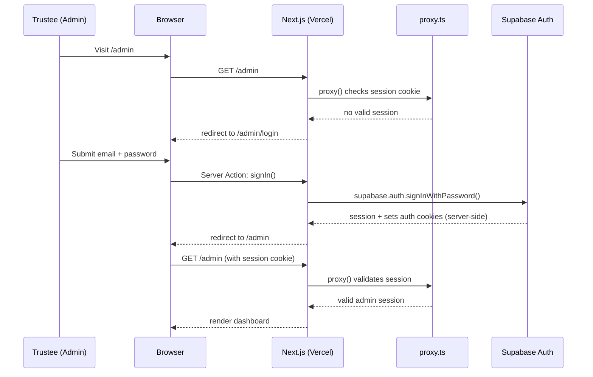

# 06. Authentication Flow

Admin-only login. No public sign-up anywhere on the site.

## Overview

## Implementation notes

- **Account provisioning**: admin accounts are created manually (Supabase dashboard or a one-off seed
  script) — there is no public or self-service admin registration UI, ever.
- **Session storage**: Supabase's Next.js server-side auth helpers store the session in HTTP-only cookies,
  read via the (now Promise-based, Next.js 16) `cookies()` API inside `lib/supabase/server.ts`.
- **Route protection**: `proxy.ts` at the project root (Next.js 16's rename of `middleware.ts`, exporting a
  function named `proxy`, Node.js runtime only) intercepts every `/admin/*` request except `/admin/login`,
  checks for a valid Supabase session, and redirects unauthenticated requests to `/admin/login`.
- **Defense in depth**: `proxy.ts` is a UX gate, not the security boundary — actual authorization is enforced
  by Postgres RLS policies (see [Database Schema](04-database-schema.md)) checking `auth.uid()` against
  `admin_users`/`roles`, so even a bypassed route guard can't read/write protected data.
- **Role model**: a single `admin` role today; the `roles` table exists so a future `editor` (content-only,
  no committee/user management) or `volunteer_manager` role can be added without a schema change.
- **Logout**: Server Action calling `supabase.auth.signOut()`, clearing the session cookie and redirecting
  to `/admin/login`.
- **Password reset**: use Supabase Auth's built-in email-based reset flow (requires configuring an SMTP
  provider or Supabase's default email sending in the Supabase dashboard) rather than building custom reset
  logic.
- **Brute-force mitigation**: rate-limit `POST` attempts to the login Server Action inside `proxy.ts`
  (simple IP+time-window counter is sufficient at this traffic scale — see [Security Checklist](16-security-checklist.md)).
